# Results gallery

Figures produced by the URBADAPT-HEAT pipeline, grouped into the **framework
figures** that illustrate how the model works (shown for Rome, the reference
city) and the **cross-city results** from the full European city sample.

!!! info "Provenance and status"

    All figures are generated directly by scripts in the
    [URBADAPT-HEAT repository](https://github.com/URBADAPT/URBADAPT-HEAT) —
    `gmd_visual_items/workflow_figures/` (Python) and `natcities_visual_items/R/`
    (R) — from model outputs, not redrawn by hand. The copies shown here are
    downscaled for the web; lossless PNG and PDF versions live in the repository.

    The cross-city results accompany manuscripts **in preparation** and should be
    treated as provisional pending peer review. At the time of writing, 40 cities
    are configured and **35 have complete results**; five (Cologne, Dublin,
    Ljubljana, Rome, Rotterdam) have partial output and are excluded from the
    cost-benefit panels.

---

## Framework figures

How each modelling stage looks in practice, using Rome as the reference city.
These correspond to the figures in the framework description manuscript.

<figure markdown>
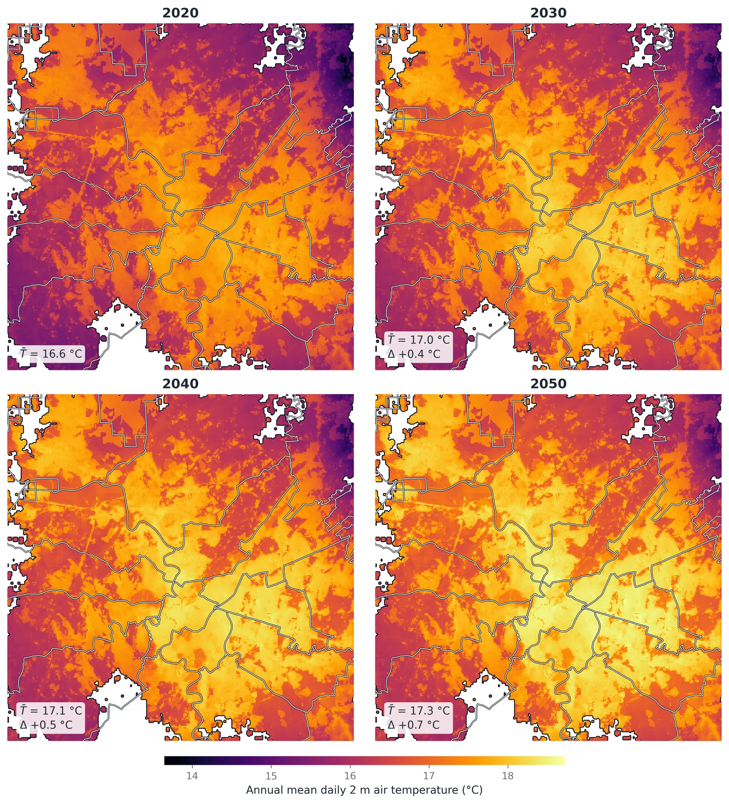
<figcaption markdown>
**Hazard — annual-mean daily air temperature.** UrbClim T2M fields across the Rome
functional urban area at ~100 m resolution, one panel per target year (2020
baseline through 2050). Municipal boundaries are overlaid on the FUA footprint.
The urban heat island is visible as a persistent warm core, and the whole
distribution shifts upward under the climate deltas.
See [Hazard](heat/hazard.md) for how these fields are constructed.
</figcaption>
</figure>

<figure markdown>
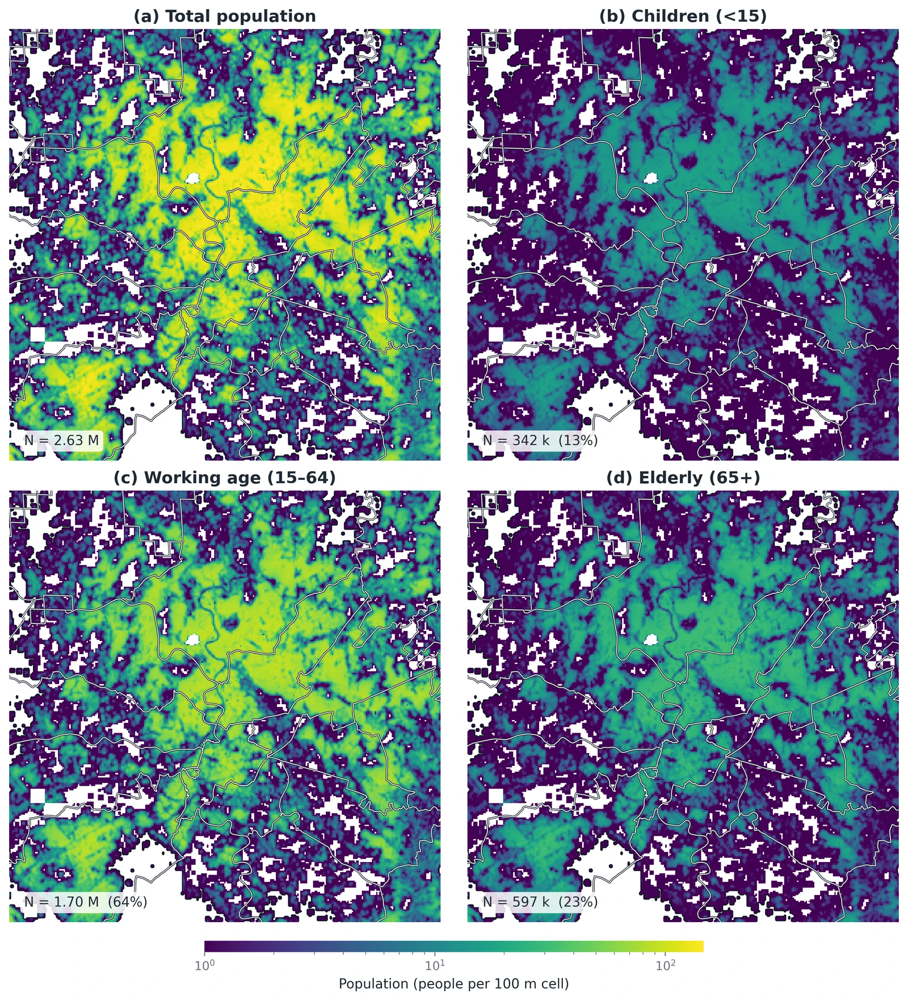
<figcaption markdown>
**Exposure — resident population by age group.** 2020 exposed population across the
Rome FUA on a logarithmic scale: total population and the age-stratified breakdown
used by the impact functions. Age structure matters because heat-mortality risk is
strongly concentrated in older cohorts.
See [Exposure](heat/exposure.md).
</figcaption>
</figure>

<figure markdown>
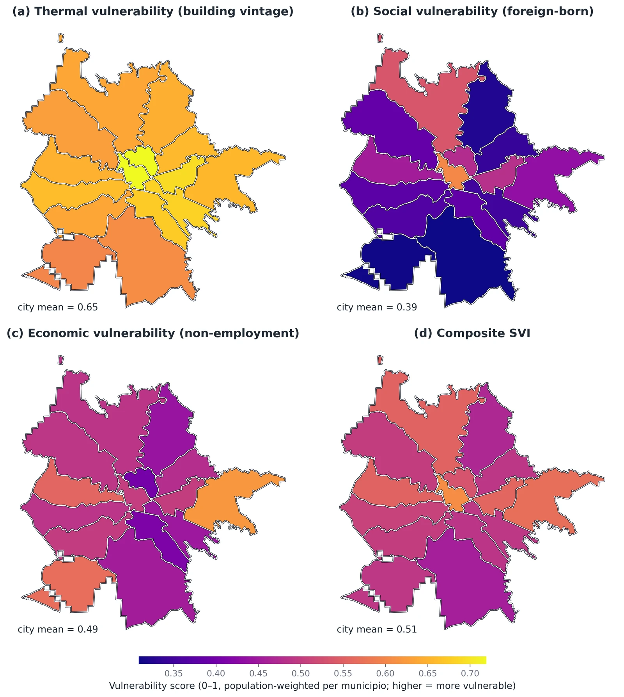
<figcaption markdown>
**Vulnerability — Social Vulnerability Index and its components.** Per-*municipio*
choropleths of the individual SVI dimensions and the composite index, projected to
2050 under SSP2. The composite index is what stratifies the distributional
results, so that adaptation benefits can be reported across vulnerability
quintiles rather than only as city totals.
See [Vulnerability](heat/vulnerability.md).
</figcaption>
</figure>

<figure markdown>
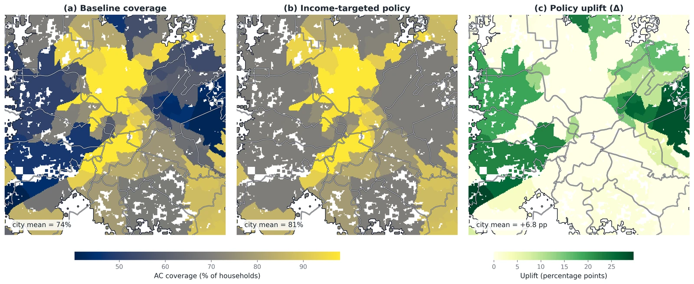
<figcaption markdown>
**Adaptation — air conditioning coverage under an income-targeted policy.** Modelled
AC coverage across Rome in 2050: the baseline, the coverage reached under an
income-targeted rollout, and the resulting uplift. Coverage is downscaled onto the
grid by income rank, so a targeted policy concentrates the uplift in lower-income
areas rather than spreading it uniformly.
See [Adaptation pathways](heat/adaptation-pathways.md).
</figcaption>
</figure>

<figure markdown>
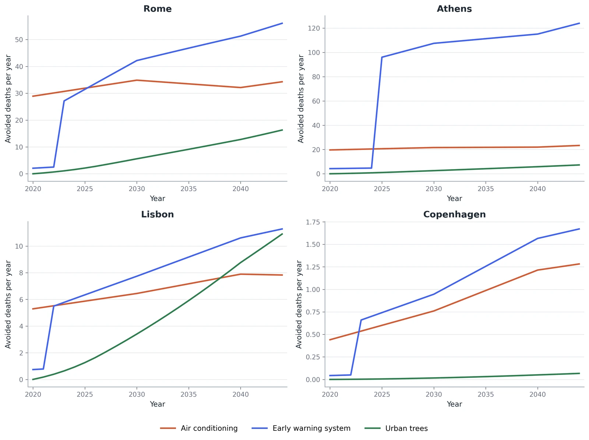
<figcaption markdown>
**Adaptation benefit trajectories, 2020–2045.** Annual avoided deaths for each of the
three pathways across the four end-to-end pilot cities. Early warning systems step
up sharply at their deployment year and then grow with the hazard; air conditioning
delivers a flatter benefit from an already-high baseline; street trees ramp in
gradually as the canopy matures. Note the differing y-axis scales — Copenhagen's
absolute mortality burden is two orders of magnitude below Athens'.
</figcaption>
</figure>

<figure markdown>
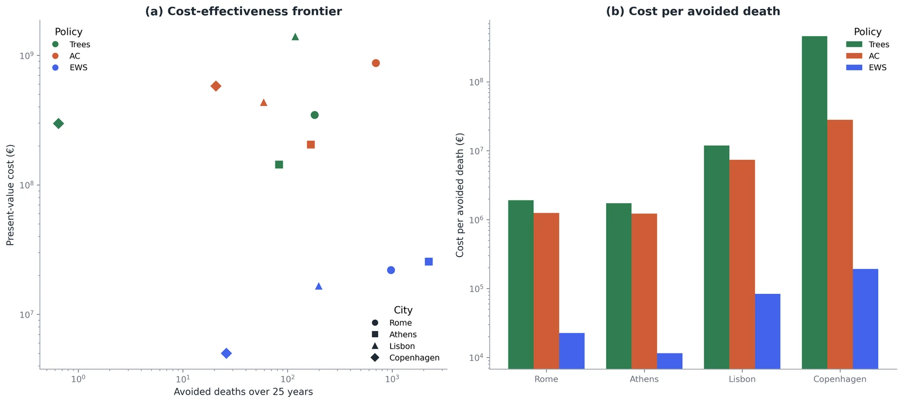
<figcaption markdown>
**Cost-benefit dashboard.** (a) The cross-city cost-effectiveness frontier, and
(b) cost per avoided death by pathway. This is the output that drives the Pareto
budget optimisation: pathways are ranked not by gross lives saved but by lives
saved per euro of discounted 25-year cost.
See [Cost-benefit analysis](heat/cost-benefit-analysis.md).
</figcaption>
</figure>

---

## Cross-city results

Findings across the European city sample. Cities are grouped by a **climate
cluster** derived from 2020 warm-season temperature, its 95th percentile, and
hot-day count — 17 Cool, 13 Temperate, 10 Hot. Metrics are normalised (per
100 000 people, per capita, shares, slopes) so that cities of very different size
remain comparable; one point is one city.

<figure markdown>
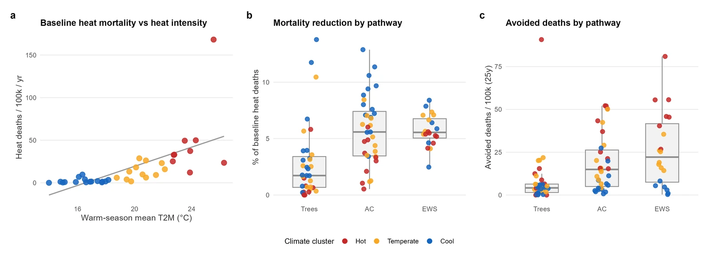
<figcaption markdown>
**Risk and adaptation effectiveness across cities.** Baseline heat mortality per
100 000 against heat intensity, alongside the percentage reduction and the avoided
deaths per 100 000 delivered by each pathway. The relationship between climate
exposure and mortality burden is what makes normalised cross-city comparison
possible in the first place.
</figcaption>
</figure>

<figure markdown>
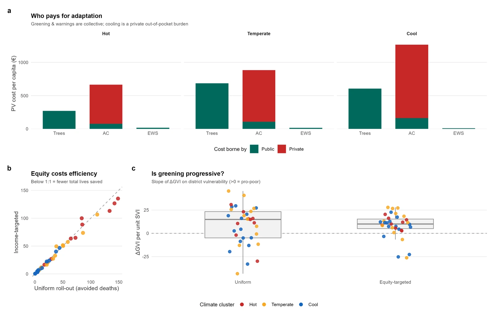
<figcaption markdown>
**Distribution of costs and benefits.** Public versus private cost per capita by
adaptation lever, faceted by climate cluster; the equity-versus-efficiency
trade-off between targeted and uniform rollout; and the progressivity slope of
greening allocation against social vulnerability. This is where the public–private
split matters most: air conditioning shifts cost onto households, while trees and
early warning systems are borne publicly.
</figcaption>
</figure>

<figure markdown>
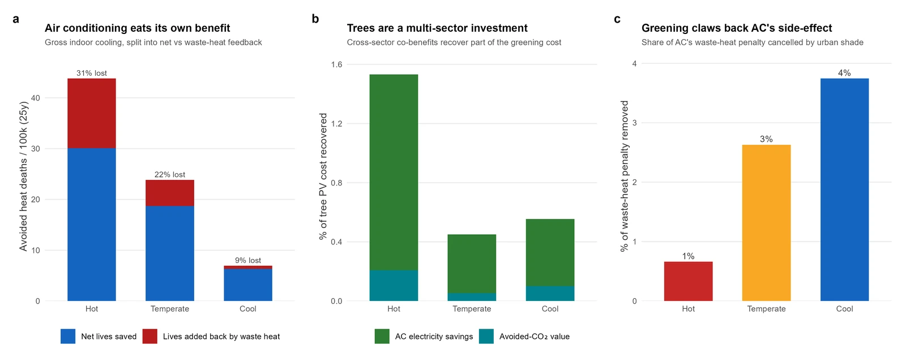
<figcaption markdown>
**Synergies and trade-offs between pathways.** The air-conditioning mortality ledger
— deaths avoided indoors, against deaths added back by waste heat released
outdoors; the share of tree costs recovered through avoided electricity demand and
CO₂; and the fraction of the AC waste-heat penalty cancelled by greening. The
co-benefit and offset terms are real but modest in magnitude, which is itself the
policy-relevant finding.
</figcaption>
</figure>

### Exemplar city dashboards

One detailed dashboard per climate cluster, for the city closest to that cluster's
centre (its medoid). These hold the city-specific detail deliberately kept out of
the cross-city summaries.

<figure markdown>
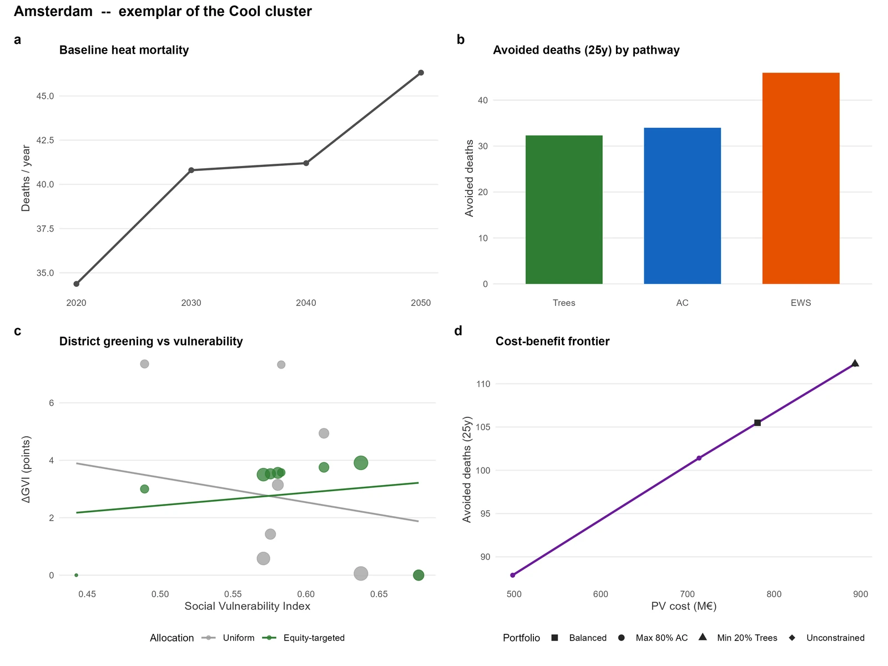
<figcaption markdown>
**Amsterdam** — medoid of the *Cool* cluster (17 cities).
</figcaption>
</figure>

<figure markdown>
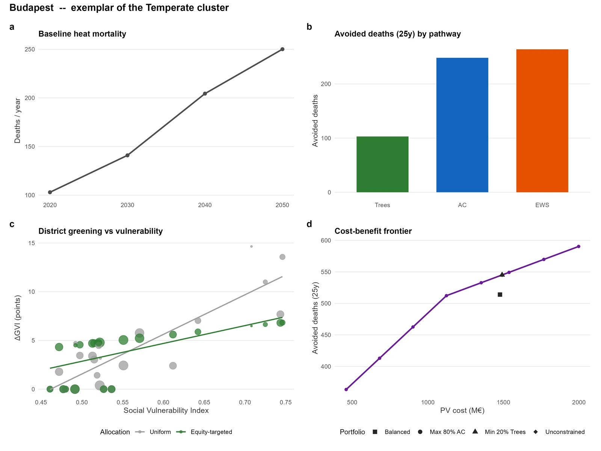
<figcaption markdown>
**Budapest** — medoid of the *Temperate* cluster (13 cities).
</figcaption>
</figure>

<figure markdown>
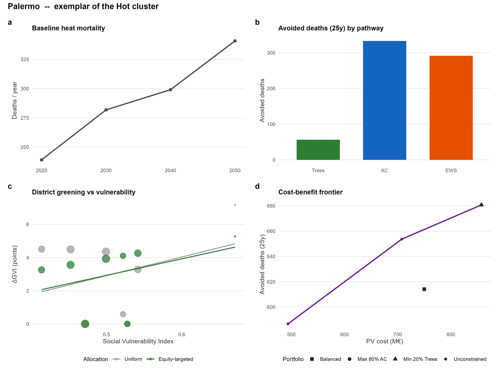
<figcaption markdown>
**Palermo** — medoid of the *Hot* cluster (10 cities).
</figcaption>
</figure>

---

## Reproducing these figures

The framework figures are rebuilt from a city's model outputs with:

```bash
python gmd_visual_items/workflow_figures/make_figures.py
```

The cross-city figures and tables are built in R, pointed at the multi-city run
directory:

```powershell
$env:NATCITIES_OUTPUTS_BASE = "<path to the 40-city run>"
cd natcities_visual_items/R
Rscript build_all.R
```

Per-city numerical results behind these figures are written as CSV and LaTeX
tables to `natcities_visual_items/tables/`. See
[Case studies](heat/case-studies.md) for the narrative results of the four
end-to-end pilot cities.
