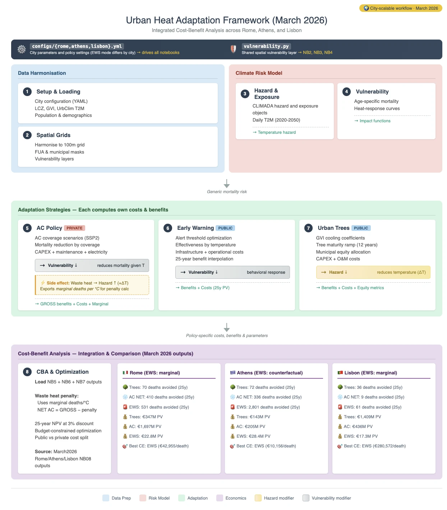

<div class="urb-hero" markdown>

{ .urb-hero__logo }

<p class="urb-hero__tagline">
Open-source geospatial frameworks for <strong>city-level climate risk assessment</strong>
and <strong>public–private adaptation cost-benefit analysis</strong> — reproducible
and city-agnostic.
</p>

<div class="urb-hero__buttons" markdown>
[Read the documentation](heat/index.md){ .md-button .md-button--primary }
[Results gallery](gallery.md){ .md-button }
[Code on GitHub](https://github.com/URBADAPT/URBADAPT-HEAT){ .md-button }
</div>

</div>

---

## What URBADAPT does

URBADAPT is a modular architecture for assessing urban climate risk and appraising
adaptation investment. Each hazard-specific implementation shares the same
structure — hazard, exposure, vulnerability, impact functions, adaptation
pathways, cost-benefit analysis — so that methods and results stay comparable
across hazards and across cities.

Configuration is fully externalised to city-specific YAML files. The same
analytical code runs unchanged everywhere: adding a city means adding a config
and a data manifest, not editing the model.

<div class="grid cards" markdown>

-   :material-thermometer-high:{ .lg .middle } __URBADAPT-HEAT__ — available

    ---

    Urban heat risk and adaptation appraisal at ~100 m resolution for European
    functional urban areas. Quantifies heat-attributable mortality to 2050 and
    evaluates air conditioning, urban street trees, and early warning systems
    through their physical mechanisms.

    [:octicons-arrow-right-24: Documentation](heat/index.md)

-   :material-waves:{ .lg .middle } __URBADAPT-FLOOD__ — in development

    ---

    The flood-hazard implementation of the same architecture. Not yet publicly
    released; this page will link to its documentation when it is.

-   :material-cube-outline:{ .lg .middle } __Shared architecture__

    ---

    A common risk-assessment spine — CLIMADA hazard/exposure/impact objects,
    age-stratified demographics, a composite Social Vulnerability Index, and a
    discounted CBA layer with externalities and co-benefits.

    [:octicons-arrow-right-24: Framework overview](heat/framework-overview.md)

-   :material-chart-scatter-plot:{ .lg .middle } __Results__

    ---

    Hazard, exposure and vulnerability maps, adaptation policy levers, and
    cross-city findings from 35 European cities with complete model runs.

    [:octicons-arrow-right-24: Results gallery](gallery.md)

</div>

---

## URBADAPT-HEAT at a glance

| | |
|---|---|
| **Spatial resolution** | ~100 m (UrbClim native grid, EPSG:3035) |
| **Temporal horizon** | 2020 · 2030 · 2040 · 2050 |
| **Climate scenarios** | CurPol, GS, SP, SSP5-8.5 (CMIP6 ensemble) |
| **Demographic scenarios** | SSP1–5, SSP2-DM, SSP2-ZM (Wittgenstein Centre) |
| **Cities configured** | 40+ European functional urban areas |
| **Cities demonstrated end-to-end** | Rome · Athens · Lisbon · Copenhagen |
| **Adaptation pathways** | Air conditioning · urban street trees · early warning systems |
| **Impact functions** | Masselot et al. city- and age-specific (main); Burke et al. (sensitivity) |
| **Risk engine** | [CLIMADA v6.1.0](https://github.com/CLIMADA-project/climada_python) |
| **Licence** | [CC0 1.0](https://github.com/URBADAPT/URBADAPT-HEAT/blob/main/LICENSE) |

<figure markdown>

<figcaption>
<strong>The URBADAPT-HEAT pipeline.</strong> Ten numbered notebooks carry a city from
raw UrbClim climate fields and WorldPop demographics through hazard, exposure and
vulnerability construction, impact modelling, adaptation-pathway simulation, and
a 25-year discounted cost-benefit analysis to a Pareto-optimal portfolio.
</figcaption>
</figure>

---

## Quick start

```bash
git clone https://github.com/URBADAPT/URBADAPT-HEAT.git
cd URBADAPT-HEAT
conda env create -f urban-heat/environment.yml
conda activate urbanheat
pip install -e urban-heat          # installs the cityheat helper package
jupyter-lab urban-heat/notebooks   # open the notebook pipeline
```

Select a city with a single line near the top of notebook 01, then run `01` → `10`
in order:

```python
os.environ["CITY"] = "Rome"   # or Athens / Lisbon / Copenhagen
```

See [Installation & usage](heat/installation.md) for the full walkthrough, including
data sync and the one-click Windows launcher.

---

## Citation

If you use URBADAPT-HEAT, please cite the framework description:

> Aboudrar-Méda, A. and Falchetta, G.: *URBADAPT-HEAT v1.0: a scalable geospatial
> framework for city-level public–private adaptation infrastructure cost-benefit
> analysis and its urban heat risk implementation*, in preparation, 2026.

Full citation details, the model's data sources, and contact information are on the
[About](about.md) page.
